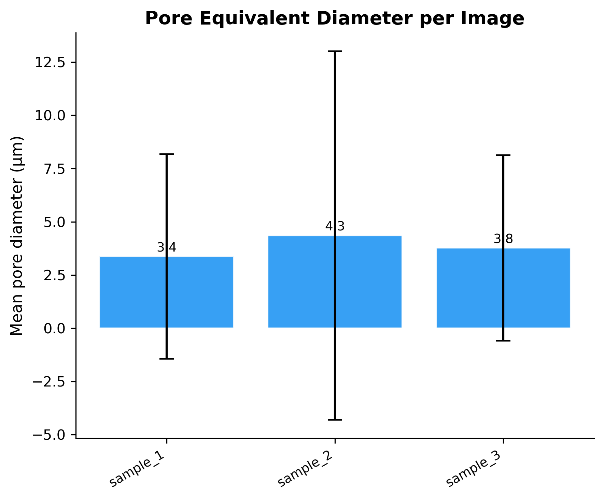
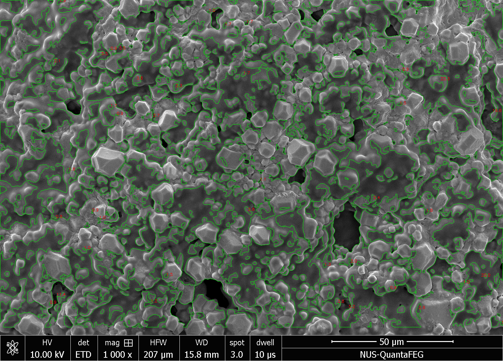

# SEM Pore Analysis


Automated pore size quantification from Scanning Electron Microscopy (SEM) images using adaptive Gaussian thresholding and contour analysis. Built for **batch processing** — recursively walks an input directory and analyses every image in a single run. In the original study, this pipeline was used to batch-analyse **62 SEM micrographs**, detecting over **26,000 pores** across multiple sample categories and time points, but the tool scales to any number of images.

## Overview

In SEM micrographs of porous materials, pores appear as dark regions against a brighter solid matrix. This tool segments those dark regions, filters by size, and computes equivalent circular diameters for each detected pore, providing:

- **Scalable batch analysis** — point it at a directory tree with any number of images and get a consolidated CSV
- **Per-image pore statistics** (count, mean/median/SD diameter)
- **Annotated images** with green pore contours and red diameter labels
- **Binary masks** (white = pore, black = background)
- **Publication-ready figures** (composite overlay + summary bar chart)
- **Reproducible CSV output** with full analysis parameters

## Algorithm

```
 SEM grayscale image (.tif)
        |
        v
 Crop metadata bar (bottom region)
        |
        v
 Gaussian blur (noise reduction)
        |
        v
 Adaptive Gaussian threshold (BINARY_INV)
   |-- Block size: neighbourhood for local threshold
   |-- C value:    constant subtracted from local mean
        |
        v
 Binary mask (dark pores -> white)
        |
        v
 Morphological opening (remove salt noise)
        |
        v
 Contour detection  ->  Filter by area & diameter
        |
        v
 Equivalent diameter:  D = 2 * sqrt(Area / pi)
        |
        v
 CSV statistics  +  Annotated images  +  Binary masks
```

The adaptive threshold computes a separate threshold for each pixel neighbourhood, making it robust to uneven illumination and contrast gradients common in SEM imaging.

## Example Output

### Composite Segmentation

Top row: original SEM micrographs. Bottom row: detected pore regions (magenta overlay).


### Pore Diameter Chart



### Annotated Image (with contours and diameter labels)



### CSV Results

| Image | N Pores | Mean (µm) | SD (µm) | Median (µm) |
|-------|---------|-----------|---------|-------------|
| sample_1 | 455 | 3.37 | 4.81 | 1.71 |
| sample_2 | 24 | 4.35 | 8.66 | 1.46 |
| sample_3 | 341 | 3.77 | 4.36 | 2.29 |

## Installation

```bash
git clone https://github.com/Harsh9005/sem-pore-analysis.git
cd sem-pore-analysis
pip install -r requirements.txt
```

**Dependencies:** NumPy, Pandas, OpenCV, Matplotlib

## Usage

### 1. Pore Analysis (statistics + figures)

```bash
python sem_pore_analysis.py --input example_data/
```

### 2. Generate Annotated Images

```bash
python generate_annotated_images.py --input example_data/
```

### Batch analysis

Both scripts recursively walk the input directory, so you can point them at a folder tree containing hundreds of images and every `.tif` file will be processed in one run:

```bash
# Analyse an entire dataset organised in sub-folders
python sem_pore_analysis.py --input /path/to/dataset/

# Only process 1000x magnification images
python sem_pore_analysis.py --input /path/to/dataset/ --magnification-filter 1000x
```

In the original study this pipeline batch-processed **62 images** and detected **>26,000 pores** across multiple experimental conditions. The tool imposes no upper limit on dataset size.

### Custom parameters

```bash
python sem_pore_analysis.py \
    --input path/to/images/ \
    --output path/to/results/ \
    --block-size 499 \
    --c-value 15 \
    --hfw 207.0 \
    --min-area 1.0 \
    --max-diameter 30 \
    --format png \
    --dpi 150
```

### All options (sem_pore_analysis.py)

| Argument | Default | Description |
|----------|---------|-------------|
| `--input` | *required* | Directory with `.tif` SEM images (recursive) |
| `--output` | `<input>/analysis_output` | Output directory |
| `--block-size` | `899` | Adaptive threshold neighbourhood size (px) |
| `--c-value` | `10` | Constant subtracted from local mean |
| `--image-width` | `1536` | Image width in pixels (for calibration) |
| `--hfw` | `207.0` | Horizontal field width in µm |
| `--min-area` | `0.5` | Minimum pore area in µm² |
| `--max-diameter` | `50.0` | Maximum pore equivalent diameter in µm |
| `--blur-kernel` | `5` | Gaussian blur kernel size |
| `--crop-height` | `1000` | Crop height to exclude metadata bar (px) |
| `--morph-kernel` | `3` | Morphological opening kernel size |
| `--magnification-filter` | none | Only process files containing this string |
| `--dpi` | `300` | Figure resolution |
| `--format` | `png` | Output format (`png`, `tiff`, `pdf`) |

## Output Files

```
analysis_output/
├── pore_analysis_results.csv      # Per-image pore statistics
├── composite_segmentation.png     # Side-by-side original + overlay
├── pore_diameter_chart.png        # Summary bar chart
├── analysis_parameters.txt        # Full parameter log
├── sample_1_mask.png              # Binary mask per image
├── sample_2_mask.png
└── sample_3_mask.png

annotated_output/
├── Annotated_sample_1.png         # Green contours + red labels
├── Annotated_sample_2.png
├── Annotated_sample_3.png
├── Mask_sample_1.png              # Full-size binary masks
├── Mask_sample_2.png
└── Mask_sample_3.png
```

## How It Works

1. **Metadata bar cropping** — SEM software typically adds an information bar at the bottom of the image. The crop height parameter removes this region before analysis.

2. **Gaussian smoothing** — A small blur kernel reduces pixel noise without significantly affecting pore boundaries.

3. **Adaptive Gaussian thresholding** — Unlike global thresholding (e.g. Otsu's method), adaptive thresholding computes a local threshold for each pixel based on the weighted mean of its neighbourhood. This handles uneven brightness gradients across the field of view. The threshold is inverted so that dark pores become white in the binary mask.

4. **Morphological opening** — An erosion followed by dilation with a small kernel removes isolated bright pixels (false positives) while preserving the shape of genuine pore regions.

5. **Contour analysis** — OpenCV contour detection identifies connected white regions. Each contour's area is converted from pixels to µm² using the known calibration (image width in pixels / horizontal field width in µm). Contours outside the area and diameter bounds are discarded.

6. **Equivalent diameter** — For each valid pore, the equivalent circular diameter is computed as `D = 2 * sqrt(Area / pi)`, representing the diameter of a circle with the same area as the detected pore.

## Image Requirements

- **Format:** `.tif` (grayscale SEM micrographs)
- **Calibration:** Known image width and horizontal field width at the imaging magnification
- **Default calibration:** 1536 px / 207 µm (1000x magnification) — adjust via `--image-width` and `--hfw` for other setups

## Author

**Harshvardhan Modh**

## License

This project is licensed under the MIT License — see [LICENSE](LICENSE) for details.
